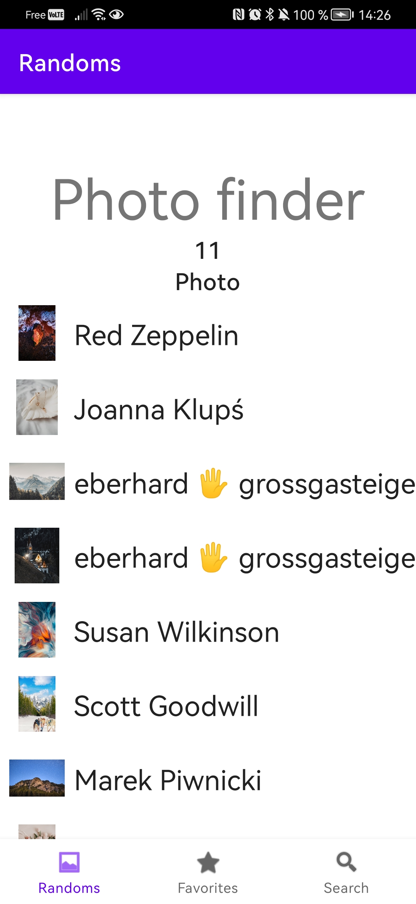
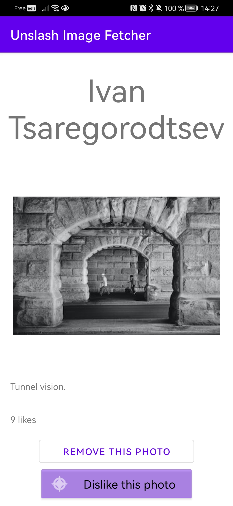
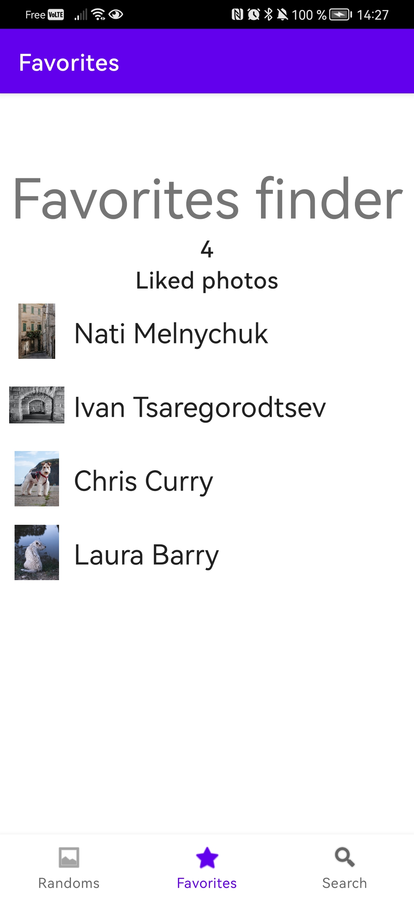

# Android-Unslpash-s-Photo-Fetcher

<h3><u><b> Introduction</b></u> </h3>
<p> 
This application has used as a template the RecylerViewKotlin app into <a href="https://github.com/android/views-widgets-samples">The Official View Widgets Samples repository</a> maintained by the offical Android's dev team.
It have been made for a school project for my last engineer degree's year at Unilasalle Amiens between 01-18-2023 and 01-21-2023. 

>If you've planned to use this project as template, stay aware that many improvments (Threads managment, Retrofit2's callback, code duplication etc...) would have to be done due to the fact that it was a schoolar project made in 3 days.

</p>

<h3><u><b> How to use</b></u> </h3>

<p>

> Into your <u>gradle.properties</u> file, located at the project's root, create a registered value called : <b>UNSPLASH_API_KEY = "Bearer my_token_from_unsplash"</b>

<b>Or</b>

> ```shell
> cat UNSPLASH_API_KEY = "Bearer my_token_from_unsplash" > ./local.properties
> ```

> When you launch the app, likes number are updated for cached entities then in parallel the database clears all the entities that doesn't have their field 'is_cached' set at "true".
> Finally with Retrofit2 we fetch 11 random photos from the Unsplash's API, we store the urls with Sqlite and we can make it persists until we dislike the photo.
> Here's a global scheme of what are the steps to display the data that are stored into the database and then into the RecyclerView.

> 

> When you launch the app you'll see the collection of images display into a RecyclerView
> 

> When you click on the row that you want you'll enter into the detail activity wich looks like that :
> 

> You can like/dislike a photo by clicking on the "like/dislike" button, it'll send again with Retrofit2 a POST/DELETE message to the Unsplash's API :
> When you like a photo, the download_url is used to fetch image byte array in the small format and store it therein a sqlite BLOB to displays 
> it natively instead of using its uri with Picasso. 
> It'll also permit without network to show these registered photos and access to the detail. 

> You can search specific photos instead of random ones :
> 

> You can also delete any entry, it'll erase them from the database :
> 

> Photos that are liked are saved at each new launch, and you can find into the "favorites" tab :
> 
> 
</p>
